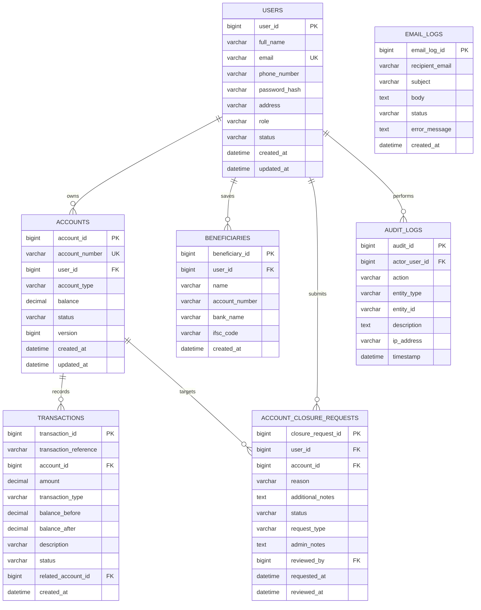

# Entity-Relationship Diagram

This renders automatically when viewed on GitHub (GitHub supports Mermaid in Markdown). If viewing elsewhere, paste the code block into https://mermaid.live to render it.

## Design Notes

- **Authoritative Schema:** Managed via Alembic migrations (`backend/alembic/versions/`).
- **users -> accounts** is one-to-many: a customer can hold multiple accounts (e.g. `SAVINGS` and `CURRENT`), but each account belongs to exactly one customer.
- **accounts -> transactions** is one-to-many: every deposit, withdrawal, and leg of a transfer is recorded as a distinct row scoped to an account.
- **Fund Transfers:** A transfer produces two atomic `TRANSFER`-type transaction rows (debit `TRANSFER_OUT` + credit `TRANSFER_IN`) linked via a shared `transaction_reference`. Source and destination rows are acquired using ordered row locks to prevent deadlocks.
- **account_closure_requests:** Unifies account service requests (`CLOSURE` and `REOPEN`) with administrative review workflows.
- **audit_logs & email_logs:** System-wide traceability for administrative actions, compliance auditing, and email notification dispatch history.
